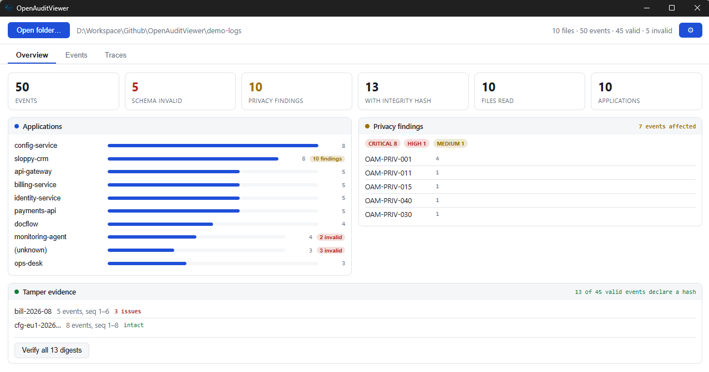
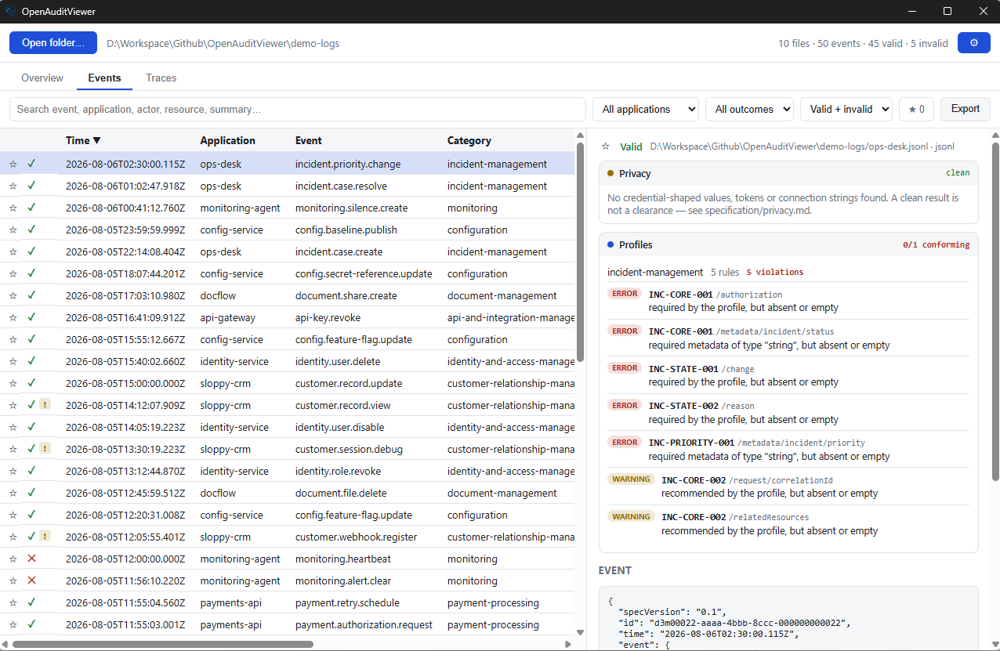
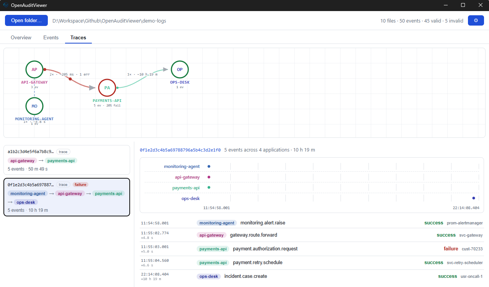

# OpenAuditViewer

A desktop application for reading [OpenAuditModel](https://github.com/OpenAuditModel/OpenAuditModel)
audit logs. Point it at a folder — a few files or a few hundred, from one application or a dozen —
and it validates every event, scans for values that should not be in an audit log, verifies
tamper-evidence digests and chains, checks domain profiles, and reconstructs the flows that crossed
application boundaries.

The analysis runs entirely on your machine. The app reads only from sources you point it at, sends
audit content nowhere — no telemetry, no crash reporting, no remote validation service — and writes
nothing except an export you ask for.

**Status: experimental.** It works and it is tested, but it is young, it has not been externally
audited, and interfaces may change.



_The Overview tab. Screenshots on this page show the demo dataset produced by `npm run demo-logs`,
which deliberately contains invalid events, planted credential-shaped values and a damaged hash
chain._

## Why it exists

The specification ships a CLI that answers these questions one command at a time. That is the right
shape for CI, and the wrong shape for the afternoon when someone hands you an archive and asks what
is in it. This is the same analysis with a table in front of it.

Privacy linting and profile conformance are not reimplemented here: this app imports the engines
from `@openauditmodel/cli`, pinned to one exact release along with the schema and the profile
definitions it evaluates. Integrity stays local, because Web Crypto is asynchronous where Node's
hashing is not. A test suite runs both sides over every fixture the published conformance kit names
and asserts the answers are identical, so "the answers match the CLI" is a check rather than a
claim.

## What it reads

Every recognized file under the folder you pick, recursively:

| Format               | Notes                            |
| -------------------- | -------------------------------- |
| `.json`              | One event, or an array of events |
| `.jsonl` / `.ndjson` | One event per line               |

Only what the specification defines. CSV and other flat exports are deliberately not read: the
event model is a JSON structure, and mapping arbitrary columns onto it would mean inventing a
correspondence the producer never declared, then presenting the result as conformant. Converting
an export to JSON Lines is the producer's decision to make, and their mapping to document.

## What it checks

- **Schema validation** against a vendored copy of the canonical schema, reporting the same
  messages and JSON Pointers as the CLI.
- **Privacy linting** with the specification's deterministic rules: credential-shaped field names,
  known token formats, connection strings, credentials in URLs, high-entropy values, oversized
  payloads. A finding names the rule and the path, never the value.
- **Digest verification** — `integrity.hash` recomputed with RFC 8785 canonicalization and
  SHA-256/384/512. Per event, or across the whole folder on request.
- **Chain verification** — events sharing an `integrity.chainId`, ordered by `sequence`, with every
  `previousHash` link checked against its predecessor.
- **Profile conformance** against the ten published profiles, for whichever ones govern each event.

**Signature verification is deliberately absent.** `integrity.signature` is neither checked nor
reported on. The app has no key registry and no trustworthy way to obtain a key; verifying a
signature against a key taken from the same folder as the events would prove nothing. This matches
the CLI's behaviour when run without `--public-key`.

## What it shows

**Events** — a sortable, filterable table. Each row carries its validity and a flag when the
privacy scan found something. Selecting one opens a panel with the schema findings, the privacy
findings, integrity and chain results, profile conformance, a per-path diff of
`change.before`/`change.after`, and the raw JSON.



The selected event above is valid against the core schema and clean of privacy findings, and still
fails the incident-management profile five times over: it records no authorization decision, no
incident status and no reason for a priority change. Core validity and domain conformance are
separate questions, and the panel keeps them separate.

**Overview** — totals, a per-application breakdown that filters the table when clicked, privacy
findings by severity and by rule, chain health, and a button to verify every digest at once.

**Observed Flow** — cross-application flows, built from `request.traceId` and
`request.correlationId`. Observed, because ordering and identifiers are all it has: a causal graph
would need `request.parentSpanId`, which the model does not carry.
An aggregated service map shows which applications hand work to which, with the transition count,
median gap and failure count on each edge, and a health ring on each node. Selecting a flow
highlights the path it actually took; selecting a node filters the events to that application.
Below the map, each flow appears as a per-application timeline and an ordered event list.



The flow above starts with a monitoring alert, passes through the gateway to a payment authorization
that fails, schedules a retry, and ends ten hours later with an incident being opened — five events
from four applications, linked only because they carry the same `traceId`.

Flows are built only from identifiers the producer declared. Grouping by "same resource" or "same
actor" would link events that merely touch the same thing, and showing that as one flow would claim
more than the data says.

## Running it

Requires Node.js 22 or newer. Building the desktop application also needs the Rust toolchain, and on
Windows the MSVC build tools ("Desktop development with C++", from either the standalone Build Tools
or a full Visual Studio installation). On macOS it needs the Xcode command line tools
(`xcode-select --install`), and a universal build needs both Rust targets:
`rustup target add aarch64-apple-darwin x86_64-apple-darwin`.

```bash
npm install
npm run tauri dev      # development, with hot reload
npm test               # the test suite
npm run tauri build    # release binaries
```

`npm run dev` runs the frontend alone in a browser, with no Rust prerequisites — useful when working
on the interface. File loading needs the desktop shell.

Build through the Tauri CLI rather than calling `cargo build` yourself: the CLI is what tells the
application to load its bundled frontend instead of the development server, so a binary built with
bare cargo opens a window and renders nothing.

To have something to look at:

```bash
npm run demo-logs      # writes demo-logs/, then open that folder in the app
```

The demo data is invented, deterministic and self-checking. It includes an intact hash chain, a
chain broken in three specific ways, events that trip seven privacy rules, profile violations, and
flows spanning four applications. Every credential-shaped value in it is recognisably fake.

## Keeping up with the specification

The schema and the profile definitions are vendored copies, so the app works offline. The cost is
that they can drift from the canonical repository:

```bash
npm run sync-vendored -- ../path/to/OpenAuditModel
```

This reports exactly what changed and regenerates the precompiled validator. Nothing checks for
drift automatically — run it after the specification moves.

## Security

The threat model is hostile file content, not a hostile user: reading someone's audit archive should
not compromise the machine reading it.

- Filesystem access is limited to the folder picked in the dialog and the file chosen when
  exporting. The capabilities file grants no static path.
- The release build ships a Content-Security-Policy with no `unsafe-eval`; the schema validator is
  precompiled so that no runtime code generation is needed. CI fails if either regresses.
- The webview cannot navigate away from the bundled app. External links open in the system browser
  through a scoped allow list.
- Structure too deeply nested to validate or display is reported as a finding rather than crashing
  the window.

See [SECURITY.md](SECURITY.md) for the full posture and how to report an issue.

## Distribution and code signing

Releases ship **one portable executable for Windows x64** and **one universal disk image for
macOS**. Download, run, delete when you are done — nothing is installed and no administrator rights
are needed on either. `npm run tauri build` still produces an MSI and an NSIS installer locally if
you want them; they are simply not published.

The macOS image is **signed with a Developer ID certificate and notarized by Apple**, so it opens on
a double click with no Gatekeeper prompt. One image covers Apple Silicon and Intel. The release job
verifies this rather than assuming it: it mounts the image it just built and runs `spctl --assess`,
`codesign --verify` and `stapler validate` against the application inside, and fails the release if
any of the three does.

The Windows binary is **unsigned**, because there is no code-signing certificate for it. In
practice:

- Windows SmartScreen shows "Windows protected your PC" on first run of a downloaded copy; the user
  clicks "More info → Run anyway". Publishing a portable executable rather than an installer avoids
  a second prompt — an installer would also raise a UAC dialog reading "unknown publisher" — but it
  does not avoid the SmartScreen warning. Only a certificate does that.
- Nothing is blocked outright, but the warning is real friction for anyone who does not know where
  the file came from.
- Each release publishes a SHA-256 alongside the binary. That detects a corrupted or truncated
  download; it is not a substitute for a signature, since the checksum sits on the same page as the
  file it describes.
- The economical routes to signing are Azure Trusted Signing or Certum's open-source certificate.
  A self-signed certificate does not help: SmartScreen ignores it.
- The executable needs the WebView2 runtime, which is present on Windows 11 and installed alongside
  Edge on Windows 10. With no installer to bootstrap it, a machine without it needs it once from
  Microsoft.

Linux is not a target: nothing is built, tested or published for it. Nothing about the application
prevents it — the same Rust shell and the same frontend would run under WebKitGTK — and it is added
if it is ever asked for, as a decision rather than a drift. Until then a Linux binary from any source
is not this project's.

## Known limitations

- No signature verification, as described above.
- Everything read stays in memory, so loading is bounded: JSON Lines files are streamed a line at a
  time, a single `.json` document over 32 MB is declined rather than read, and a load stops at
  100,000 events. Each of those is reported on screen — as is every file that could not be read and
  every directory that was not entered — but it does mean a very large archive cannot be viewed
  whole.
- Verifying chains is automatic only while a folder holds fewer than 5,000 chain members. Above
  that it is a button, like the per-event digest sweep, rather than work every load pays for.
- Loading still reads and validates every file before the table fills in. The table virtualizes, so
  scrolling stays smooth, but the initial pass over a big folder takes time.
- Only JSON and JSON Lines are read; any other export has to be converted first.
- Vendored schema and profiles can lag the canonical repository between `sync-vendored` runs.
- Directory recursion is depth-limited and does not follow symlink cycles.
- Bookmarks last for the session. The flow map layout persists; the theme choice persists.

## Contributing

See [CONTRIBUTING.md](CONTRIBUTING.md). The analysis comes from the specification's conformance
tooling and has to keep giving the same answers, so that document is mostly about which invariants
a change has to preserve.

Report security issues privately rather than in the tracker — [SECURITY.md](SECURITY.md) explains
how, and why a bug report should never carry a real audit log.

## License

[Apache License 2.0](LICENSE).
